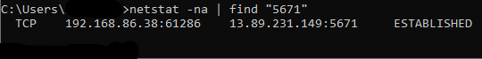

# IoTDeviceClientMultiplexing
Example demonstrating how to multiplex Azure IoT Device Clients over AMQP.

## Overview

The Azure IoT Device SDK for .NET (C#) supports multiplexing numerous DeviceClients over a single TCP/IP connection when using AMQP with TLS.

This is useful when implementing your own, custom identity translation pattern outside of Azure IoT Edge (which supports this already, up to a limit). 

For example, an industrial customer may have 800 modbus devices on the factory floor which cannot communicate directly with Azure IoT Hub over HTTPS, MQTT or AMQP.

If you implement your own identity translation gateway you can map each modbus device to a device registered in IoT Hub. Your custom gateway code would connect to the modbus devices, spool up 800 [DeviceClients](https://docs.microsoft.com/en-us/dotnet/api/microsoft.azure.devices.client.deviceclient), read the modbus data for each device and send the modbus payload to the corresponding device registered in IoT Hub, all over a single TCP/IP connection.

At scale, if you didn't implement this pattern, you would be faced with:

- Ephemeral port exhaustion; and
- IoT Hub considering the thousands of TCP connections from a single IP a potential denial of service.

## Details

To implement multiplexing you must use the [.NET (C#) Azure IoT Device SDK](https://github.com/Azure/azure-iot-sdk-csharp) and AMQP.  

The AMQP connection pool settings are described [here](https://docs.microsoft.com/en-us/dotnet/api/microsoft.azure.devices.client.amqpconnectionpoolsettings?view=azure-dotnet) and the source code is [here](https://github.com/Azure/azure-iot-sdk-csharp/blob/master/iothub/device/src/AmqpConnectionPoolSettings.cs).

```
deviceClients[i] = DeviceClient.Create(
    _ioTHubHostName,
    auth,
    new ITransportSettings[]
    {
    new AmqpTransportSettings(Microsoft.Azure.Devices.Client.TransportType.Amqp_Tcp_Only)
    {
        AmqpConnectionPoolSettings = new AmqpConnectionPoolSettings()
        {
            Pooling = _pooling,
            MaxPoolSize = _maxPoolSize
        }
    }
}, options);
```

- The ```Pooling``` property enables multiplexing.
- The ```MaxPoolSize``` sets the number of TCP/IP connections to use. 

For example, if you set ```MaxPoolSize``` to ```1``` it will result in:



If you set ```MaxPoolSize``` to ```10``` it will result in:


The default is 100 when you enable ```Pooling```.

## Example code

Open ```Multiple.cs``` and edit the settings to suit your needs. Replace ```_iotHubConnString``` with your IoT Hub owner connection string.

The code will create N number of devices in IoT Hub, create that number of DeviceClients, and send one or more messages to each client in parallel using AMQP multiplexing. Each device is registered as an IoT Plug and Play device in IoT Hub.

Be mindful of [IoT Hub throttling limits](https://docs.microsoft.com/en-us/azure/iot-hub/iot-hub-devguide-quotas-throttling) as you may hit these as you scale up!